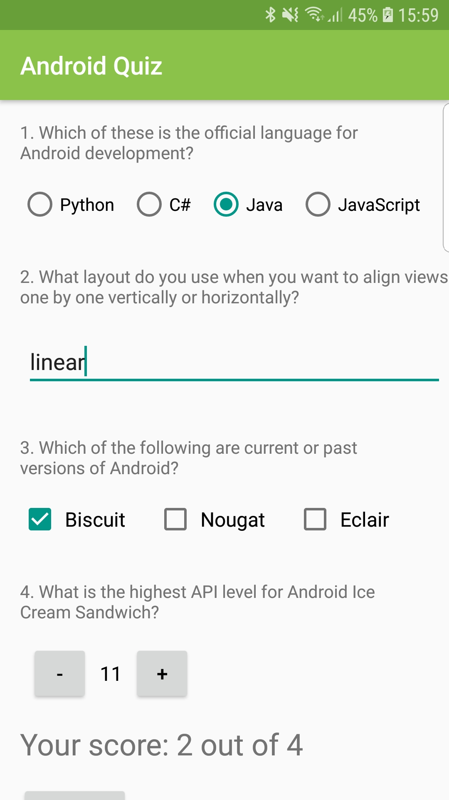

# Android Quiz
Quiz App for Udacity Android Basic Nanodegree Program
**Author**: Earl Jay Caoile  
**Version**: 1.0.0

## Overview
This Android app demonstrates the use of various forms of user input to answer a quiz about Android.

## Getting Started
The following is required to run the program.
1. Android Studio or any IDE that supports Android software development (XML and Java)
2. Java JDK
3. A working emulator or Android phone to use the app

## Visual

## Happy Path
 - open application in Android Studio
 - answer the questions to the best of your ability
 - hit the submit button and look at score
 - smile and close app

## Architecture
This application was created using Android Studio 3.1.4  
*Languages*: XML and Java 
*Type of Applicaiton*: Android Application  
*Minimum API Level*: 14  

## Credits
Tutorial provided by Udacity's Android Basics Nanodegree Program.